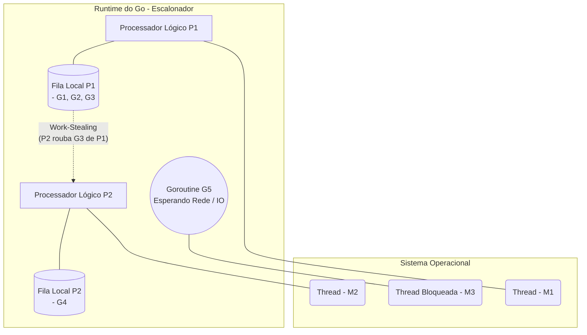

# Super Latency Bomber - STR (Sistemas de Tempo Real)

Bem-vindo ao **Super Latency Bomber**! Este projeto é um jogo multiplayer baseado em WebSockets e Go, projetado como estudo de caso para a disciplina de **Sistemas de Tempo Real (STR)**. 

Ele demonstra na prática diversos conceitos fundamentais, como **Concorrência, Deadlines, Tarefas (Tasks), Escalonamento** e **Compensação de Lag**.

---

## 🚀 Como Rodar o Projeto

### Pré-requisitos
- Ter a linguagem **Go** instalada (versão 1.18+).

### Passos para Execução
1. Abra o terminal na pasta raiz do projeto (`STR`).
2. Execute o servidor Go com:
   ```bash
   go run .
   ```
3. O terminal exibirá `Servidor rodando na porta :8080...`.
4. Abra o seu navegador e acesse: [http://localhost:8080](http://localhost:8080)
5. Aperte **ESPAÇO** para iniciar a partida!

---

## ⏱️ Analogias e Conceitos de Tempo Real

No contexto de Sistemas de Tempo Real, o jogo modela os seguintes comportamentos:

### 1. A Bomba = O Prazo (Deadline)
A bomba relógio no centro da tela representa o **Deadline Absoluto** que o sistema impõe. Os jogadores precisam reagir *exatamente* quando o timer zera (quando a bomba explode).
- Se a ação chega **antes ou na hora exata**, o deadline foi cumprido (Hit).
- Se a ação chega **após a explosão**, temos um **Deadline Miss** (Falta de Prazo), resultando na "morte" do jogador.

### 2. Classificação: Soft Real-Time (Tempo Real Frouxo)
Este é um sistema **Soft Real-Time**. Em um sistema Hard Real-Time (como o freio de um carro), perder o deadline causaria uma catástrofe fatal e falha sistêmica. Aqui, o sistema continua funcionando perfeitamente; a única consequência é a degradação da experiência (o jogador perde a partida).

### 3. Os 3 Jogadores = Tarefas Sujeitas a Atrasos
Os jogadores (P1, P2 e P3) atuam como "entidades / tarefas" que precisam enviar sinais (inputs) de forma concorrente para o servidor. 
Eles possuem simulações de **Ping (Latência)**:
- **P1 (20ms):** Uma tarefa com canal de comunicação rápido e previsível.
- **P3 (400ms):** Uma tarefa afetada por um severo atraso (jitter / delay de rede). Mostra como o tempo de propagação pode impedir o cumprimento de um deadline, mesmo que a tarefa "acredite" ter agido a tempo.

---

## 🔄 Concorrência e Tarefas (Tasks) no Sistema

Para que o servidor consiga atender os três jogadores simultaneamente em "tempo real", ele utiliza intensamente o modelo de concorrência do Go (**Goroutines**). 

### Onde ocorre a Concorrência?
Em um sistema multiplayer, as ações dos jogadores chegam ao mesmo tempo. No código `main.go` e `game.go`:
- Cada cliente conectado roda em suas próprias Goroutines para não bloquear o servidor.
- Para evitar **Condições de Corrida (Race Conditions)** quando dois jogadores apertam o botão ao mesmo tempo, usamos `sync.Mutex` (`g.mu.Lock()` e `g.mu.Unlock()`) para proteger o estado compartilhado do jogo (`g.results`, `g.state`).

### As Tarefas (Tasks) do Servidor
O sistema pode ser dividido em várias Tasks executadas concorrentemente:
1. **Task de Leitura (`readPump`)**: Fica em um loop infinito esperando mensagens do WebSocket. Responde o mais rápido possível (Event-Driven).
2. **Task de Escrita (`writePump`)**: Recebe atualizações do estado do jogo por um *Channel* e envia de volta ao cliente.
3. **Task Principal do Jogo (`Game.Run`)**: Age como um Loop de Broadcast, processando entradas e saídas de jogadores de forma thread-safe via channels.
4. **Task Temporizadora (Timer)**: Utiliza `time.AfterFunc`, que age como uma interrupção agendada. Ela é disparada assincronamente pelo SO/Runtime quando o tempo da bomba esgota.

---

## ⚙️ Algoritmo de Escalonamento: O Go Scheduler (M:N Work-Stealing)

O servidor foi construído em **Go**, cujo runtime traz um próprio algoritmo de escalonamento embutido. Diferente de linguagens onde 1 Tarefa = 1 Thread do SO (modelo 1:1), o Go usa o modelo **M:N**, onde **M** Goroutines são mapeadas para **N** Threads do Sistema Operacional.

### O Modelo G-P-M
Para entender o fluxo, precisamos conhecer as três entidades do escalonador do Go:
- **G (Goroutine):** A tarefa em si (ex: nosso `readPump` ou o temporizador da bomba).
- **M (Machine / Thread do SO):** A thread real do Sistema Operacional que executa o código na CPU.
- **P (Processor / Processador Lógico):** O contexto de execução. Ele possui uma fila local de Goroutines prontas para executar. O número de 'P's geralmente é igual ao número de núcleos do seu processador.

### Fluxo de Execução e Preempção (I/O Bloqueante)
1. Quando uma Goroutine inicia (ex: `go client.readPump()`), ela é colocada na fila local de um Processador Lógico (**P**).
2. A Thread do SO (**M**) atrelada a esse **P** pega a Goroutine da fila e a executa.
3. **Preempção Cooperativa por I/O:** O que acontece quando o `readPump` fica esperando uma mensagem da rede (I/O bloqueante)? 
   - A Thread **M** que estava executando essa Goroutine fica bloqueada no Sistema Operacional.
   - O Escalonador do Go percebe isso! Ele **desvincula o P dessa M bloqueada** e atrela o P a uma **nova M** livre.
   - O Processador Lógico **P** continua executando as outras Goroutines da sua fila local normalmente, sem travar o servidor.
4. Quando a mensagem da rede chega, a Goroutine acorda e volta para a fila de prontos.

### O Algoritmo de Work-Stealing (Roubo de Trabalho)
E se o Processador Lógico 1 (P1) terminar todas as tarefas da sua fila, mas o P2 ainda tiver 100 Goroutines aguardando?
Aqui entra o **Work-Stealing**:
- O P1 não fica ocioso. Ele olha para a fila do P2 e **"rouba" (steals)** metade das Goroutines de P2.
- Isso balanceia a carga dinamicamente, garantindo que nenhum núcleo fique sem trabalho.

### Diagrama de Fluxo (G-P-M)


---

## 🛜 Compensação de Lag (Lag Compensation)

Para solucionar a injustiça causada pelos atrasos de rede na avaliação do **Deadline**, implementamos a Compensação de Lag. O servidor ajusta o tempo de chegada com base na latência conhecida do jogador.

```go
func (g *Game) handlePress(player int, simulatedLatency int64) {
	// ... atraso de rede ...
	serverReceiveTime := time.Now().UnixMilli()
	var eventTime int64

	if g.lagComp {
		// O Servidor "retrocede" o tempo. Descobre a hora exata que a Task (Jogador) 
		// gerou o evento, compensando o atraso de propagação.
		eventTime = serverReceiveTime - simulatedLatency
	} else {
		// O Servidor usa a hora de chegada. Injusto para P3!
		eventTime = serverReceiveTime
	}

	// Avalia se cumpriu o Deadline
	if eventTime >= g.explosionTime {
		status = "DEAD" // Deadline Miss
	}
}
```
